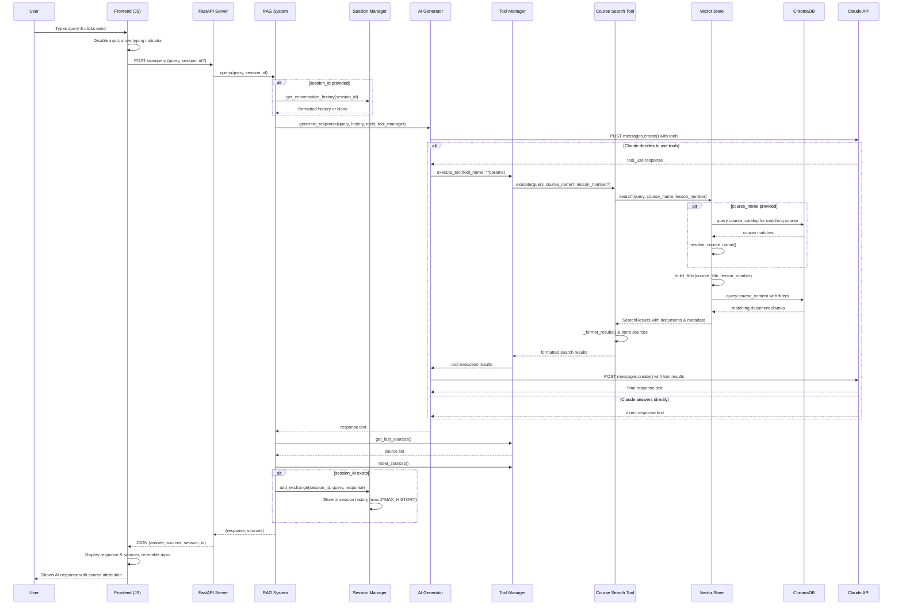

# User Request Processing Flow

This document describes how user requests are processed in the Course Materials RAG System, from frontend interaction to AI-generated response.

## Sequence Diagram

## Detailed Processing Steps

### 1. Frontend User Interaction

- **Location**: `frontend/script.js:45-50`
- User types query and clicks send button
- Frontend disables input and shows typing indicator
- Makes POST request to `/api/query` with query text and optional session_id

### 2. FastAPI Request Handling

- **Location**: `backend/app.py:56-74`
- Receives QueryRequest with query string and optional session_id
- Creates new session if none provided via `rag_system.session_manager.create_session()`
- Calls `rag_system.query(request.query, session_id)`
- Returns QueryResponse with answer, sources, and session_id

### 3. RAG System Orchestration

- **Location**: `backend/rag_system.py:102-140`
- Retrieves conversation history from SessionManager if session exists
- Creates prompt: `"Answer this question about course materials: {query}"`
- Calls AIGenerator with query, history, available tools, and tool manager
- Retrieves sources from tool manager after AI response
- Updates conversation history with user query and AI response
- Returns response and sources tuple

### 4. AI Generation Process

- **Location**: `backend/ai_generator.py:43-87`
- Builds system prompt with conversation context if available
- Prepares API parameters with tools configured for "auto" tool choice
- Makes initial call to Claude API
- If Claude decides to use tools, handles tool execution workflow
- Returns final response text

### 5. Tool Execution Workflow

- **Location**: `backend/ai_generator.py:89-135`
- When Claude responds with `tool_use`, extracts tool calls
- Calls `tool_manager.execute_tool()` for each tool requested
- Collects tool results and formats them for Claude
- Makes follow-up API call with tool results
- Returns Claude's final response incorporating tool data

### 6. Course Search Tool Process

- **Location**: `backend/search_tools.py:52-86`
- Receives search parameters: query, optional course_name, optional lesson_number
- Calls `vector_store.search()` with parameters
- Formats results with course/lesson context headers
- Tracks sources for UI display
- Returns formatted search results or error message

### 7. Vector Store Search Process

- **Location**: `backend/vector_store.py:61-100`
- If course_name provided, resolves it against course catalog using semantic search
- Builds filter dictionary for course title and/or lesson number
- Queries ChromaDB course_content collection with query text and filters
- Returns SearchResults object with documents, metadata, and distances

### 8. Session Management

- **Location**: `backend/session_manager.py:37-56`
- Stores user query and AI response as Message objects
- Maintains conversation history up to `2 * MAX_HISTORY` messages (default 4 total)
- Provides formatted conversation context for AI prompts
- Creates unique session IDs with incrementing counter

### 9. Response Processing & Display

- **Location**: `frontend/script.js` (inferred from app.py)
- Frontend receives JSON response with answer, sources, and session_id
- Displays AI response to user
- Shows source attribution from search results
- Re-enables input for next query
- Maintains session_id for conversation continuity

## Key Configuration Parameters

- **Chunk Size**: 800 characters (`config.py:19`)
- **Chunk Overlap**: 100 characters (`config.py:20`)
- **Max Search Results**: 5 (`config.py:21`)
- **Max History**: 2 exchanges (`config.py:22`)
- **AI Model**: claude-sonnet-4-20250514 (`config.py:13`)
- **Embedding Model**: all-MiniLM-L6-v2 (`config.py:16`)
- **AI Temperature**: 0 (deterministic responses) (`ai_generator.py:39`)
- **Max Tokens**: 800 (`ai_generator.py:40`)

## Error Handling

The system includes error handling at multiple levels:

- FastAPI returns HTTP 500 with error details for exceptions
- Vector store returns SearchResults with error messages for failed searches
- Tool execution returns error strings for invalid tool calls
- Frontend handles API errors (implementation details not shown in analyzed code)
